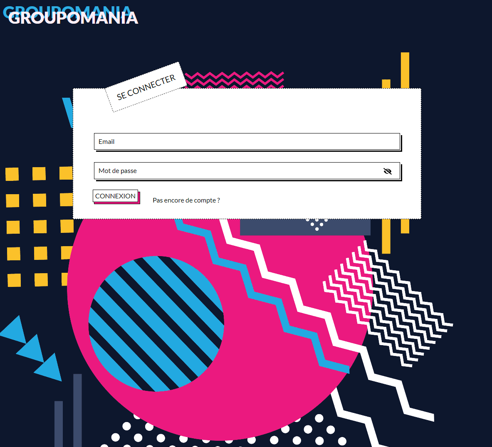

# PROJECT 7 - Groupomania

This repository contains the project 7 of OpenClassrooms training.

For this project, I have to build an entire social network from scratch (BACK-END and FRONT-END).

Follow [this link](https://open-classrooms-p7.vercel.app/) to have a look !

Backend `Heroku`

Frontend `Vercel`

> I took time to write the cleanest code possible :
 - Easy to read
 - Easy to maintain
 - Scalable 
> Performance as been improved :
 - All images are compressed in .webp
 - Images are link and unlink from the server as the user 
   - delete or update post/profile picture

>I took care of all the design (inspire by Memphis design) and be carefull about accessibility and of course responsive.

Functionalities :

`USER`
- Signup / Login
- Post messages / comments
- Like messages / comments
- Update profile and messages
- Delete messages and comments
- Delete messages and comments

`ADMIN`
- Update messages
- Delete messages and comments

**Stack**: MERN

- **M**ongoDB
- **E**xpress
- **R**eact
- **N**ode

>## How to connect :

**FRONTEND**

Open your terminal and go the  `/frontend` folder.

Run `npm install` to install all required dependencies.

Run `npm start` to start the interface on your browser (PORT 3000).

**BACKEND**

Open your terminal and go to the `/backend` folder.

Run `npm install` to install all required dependencies.

Run `npm start` to start the server and connect to the data base (PORT 4000).

**ADMIN ACCESS:**

- email: `admin@admin.com`
- password: `admin123!`